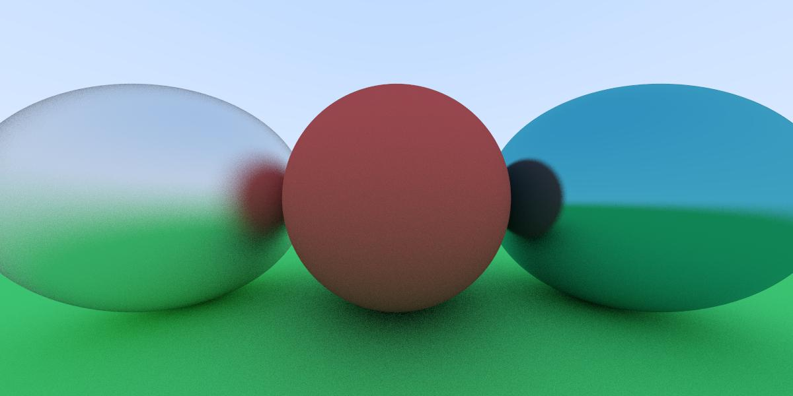
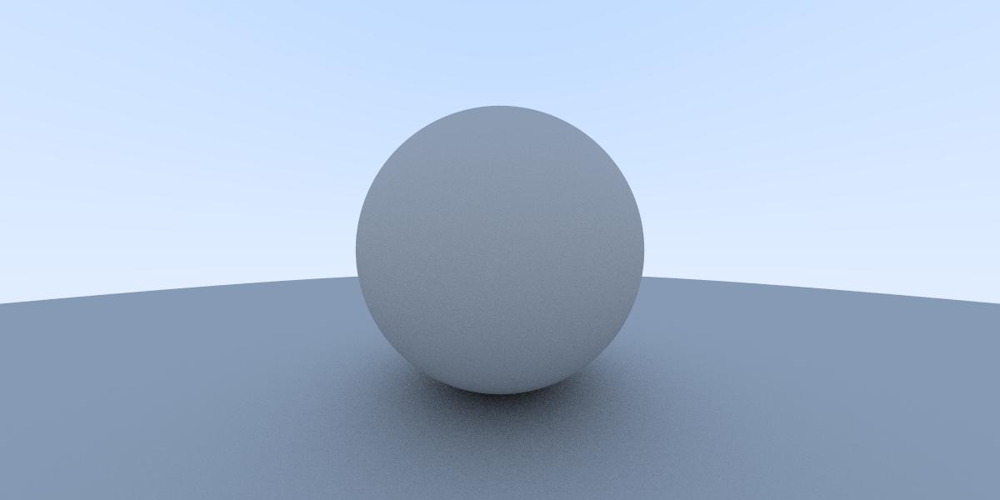
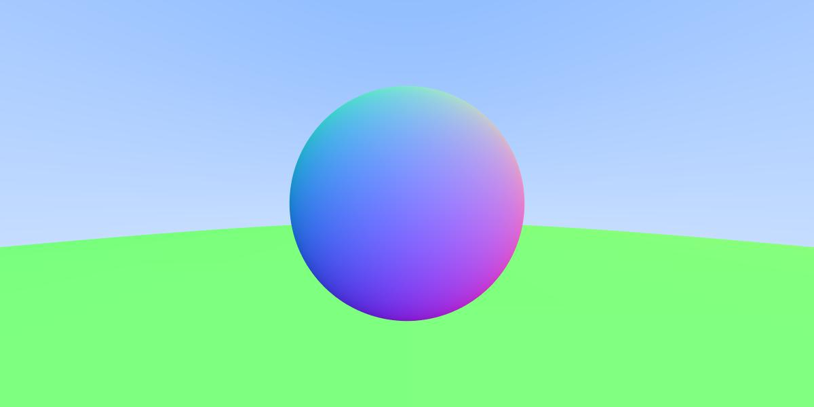

# raytracing_renderer_cuda
A C++ rendering framework using raytracing and based on cuda  (WIP)

The project will be split into the following steps:\
1 - Writing the base cuda code for the necessary algebra (vector3d, basic shapes such as spheres and cubes)\
2 - Render a simple scene with no materials. The rendering result will be a jpeg or ppm image\
3 - Add more shapes and materials, (use basic materials, maybe support .mdl format in the future?)
4 - Maybe support loading mdl (vertex and materials) (the objective is to support all mdl materials)\
5 - A aws cloud based solution where the client draws a scene in a web browser (using webGL) and sends a json file that descripes the scene (rest api) to a server (aws ec2 that supports cuda)... maybe the server will be based on **asio**\
5 - ?? \
6 - Profit

## Current state
Three spheres with metal and lambertian materials. (1200x600 image size, 100 samples per pixel)


Generate a sphere with diffuse material (1200x600 image size, 100 samples per pixel)


Generate a sphere with normals (1200x600 image size, 100 samples per pixel)


## How to run
```sh
cd raytracing_renderer_cuda
make all
make profile
```
